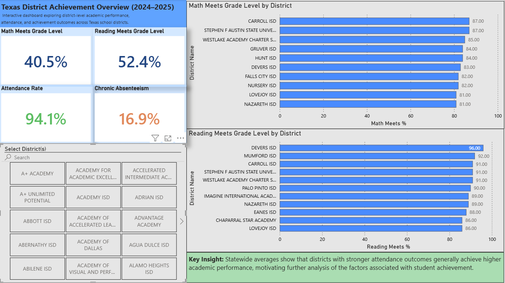
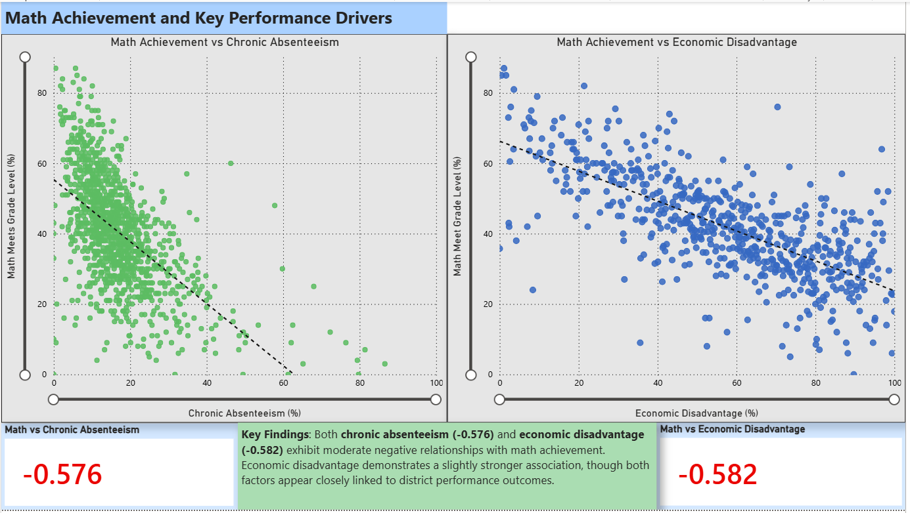

# Texas School District Performance Analysis (2024–2025)

## Project Summary

This project analyzes academic performance, attendance, and demographic data from **1,208 Texas school districts** during the 2024–2025 academic year. Using Python, statistical analysis, Linear Regression modeling, and Power BI, the project investigates factors associated with district-level math achievement and develops an interactive dashboard for exploring statewide performance trends.

The analysis identified **economic disadvantage** and **chronic absenteeism** as the strongest negative factors associated with student math achievement while also highlighting districts that outperform expectations despite demographic challenges.

---

## Dashboard Preview

### Executive Summary Dashboard

### Achievement Drivers Dashboard

---

## Business Problem

Educational leaders frequently monitor student achievement outcomes but often lack a clear understanding of which district-level factors are most strongly associated with performance.

This project explores:

- Which district characteristics are most closely associated with math achievement?
- How do chronic absenteeism and economic disadvantage relate to district performance?
- Can district math achievement be estimated using attendance and demographic indicators?

---

## Data Scope

| Attribute | Description |
|------------|------------|
| Geographic Scope | Texas School Districts |
| Academic Year | 2024–2025 |
| Unit of Analysis | School District |
| Records | 1,208 Districts |
| Target Variable | STAAR Math Meets Grade Level (%) |

---

## Repository Contents

- `Texas_District_Performance_Analysis.ipynb` – Data cleaning, exploratory analysis, correlation analysis, and Linear Regression modeling.
- `Texas_District_Performance_Dashboard.pbix` – Interactive Power BI dashboard.
- `data/` – Source datasets and cleaned analysis dataset.
- `dashboard_overview.png` – Executive Summary dashboard screenshot.
- `achievement_drivers.png` – Achievement Drivers dashboard screenshot.

---

## Tools & Technologies

- Python
- Pandas
- NumPy
- Matplotlib
- Seaborn
- Scikit-Learn
- Power BI
- Jupyter Notebook

---

## Exploratory Data Analysis

The project began with exploratory analysis to understand the distribution of district performance metrics and identify relationships among attendance, demographic, and achievement variables.

Key analyses included:

- Distribution of district math achievement
- Distribution of district enrollment
- Correlation analysis between district characteristics and math performance
- Identification of outliers and performance patterns

---

## Key Findings

### Correlation Analysis

The strongest relationships with math achievement were:

| Variable | Correlation with Math Achievement |
|-----------|-----------:|
| Economic Disadvantage (%) | -0.582 |
| Chronic Absenteeism (%) | -0.576 |
| At-Risk Students (%) | -0.468 |
| Attendance Rate (%) | 0.513 |
| Reading Meets Grade Level (%) | 0.874 |

### Key Business Insight

While economic disadvantage and chronic absenteeism exhibited the strongest negative relationships with math achievement, several districts outperformed expectations despite demographic challenges. This suggests that factors beyond attendance and demographics may contribute to district success and represent opportunities for future investigation.

Additional observations:

- Districts with higher levels of economic disadvantage generally demonstrated lower math achievement.
- Districts with higher chronic absenteeism rates generally demonstrated lower math achievement.
- Economic disadvantage exhibited a slightly stronger relationship than chronic absenteeism.
- Several districts achieved above-average performance despite significant demographic challenges.

---

## Predictive Modeling

A Linear Regression model was developed to estimate district math achievement using district-level indicators.

### Model Features

- Attendance Rate
- Chronic Absenteeism Rate
- Economic Disadvantage Percentage

### Model Performance

| Metric | Value |
|----------|----------:|
| R² | 0.483 |
| MAE | 8.687 |

The Linear Regression model explained approximately **48% of the variation in district math achievement**, indicating that attendance and demographic factors account for a meaningful portion of performance differences across Texas school districts while suggesting that additional variables may influence outcomes.

---

## Dashboard Features

### Executive Summary Page

- Statewide performance KPIs
- Highest-performing districts in math achievement
- Highest-performing districts in reading achievement
- Interactive district filtering

### Achievement Drivers Page

- Math Achievement vs Chronic Absenteeism
- Math Achievement vs Economic Disadvantage
- Correlation metrics
- Executive summary insights

---

## Data Source

Data used in this project was obtained from publicly available **Texas Education Agency (TEA)** district-level datasets, including academic performance, attendance, and demographic indicators for the 2024–2025 academic year.

---

## Future Enhancements

Potential future improvements include:

- Incorporating multiple academic years for trend analysis
- Evaluating longitudinal district performance changes
- Testing advanced machine learning models
- Building district-level forecasting tools
- Identifying districts that consistently outperform demographic expectations

---

## Skills Demonstrated

- Data Cleaning & Preparation
- Exploratory Data Analysis (EDA)
- Correlation Analysis
- Statistical Interpretation
- Linear Regression Modeling
- Data Visualization
- Dashboard Development
- Power BI
- Data Storytelling
- Educational Data Analytics

---

## Author

**Emilio Camargo**

- LinkedIn: [linkedin.com/in/emiliocamargo](https://linkedin.com/in/emiliocamargo)
- GitHub: [github.com/Emilioc15](https://github.com/Emilioc15)
